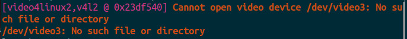

This program  is used for sending live camera video to RTMP-Server,then the rtmp-stream can be decoded and played in any player which supports RTMP protocol.

It works well on camera device such as **ASUS Xtion pro** and **Kinect**. 
Please make sure the RTMP-Server have started,and the camera device is connected correctly before executing this program.

I am using nginx-rtmp server ,please make your stream server supports RTMP protocal and make your **nginx.conf** like this:

```
# ******* custom config ******
rtmp {
    server {
        listen 1935;
		application rgb{
			live on;
			allow all;
		}
		application depth{
			live on;
			allow all;
		}
    }
}
# ******* custom config ******
```

There are two kinds of programs :

## 1.Version for C++  

First one is C++ version. The code is in /camera_pusher_program .
Compile :

```
g++ rgb_streamer.cpp  -o pusher -lOpenNI2 -lavformat -lavdevice -lavcodec -lavutil -lpthread -lswscale -lavfilter -lswresample  -lz -llzma -lbz2 -lrt -ltheoraenc -ltheoradec -lx264 `pkg-config opencv --cflags --libs`
```

Run:
```
./pusher
```

Note :This raw program  just sends RGB camera stream to RTMP-Server .

## 2.Version for ROS 

Second one is [ROS](http://wiki.ros.org/) (Robot Operating System)  version.The code is in **/xbot2_tools**  ,you can build it by `catkin_make --pkg xbot2_tools ` . 

run:

```
rosrun xbot2_tools camera_pusher
```

You can subscribe  "/camera/streamer_info" topic to receive notifications of its working state from another ROS node.

rtmp address of RGB video --  rtmp://localhost/rgb

rtmp address of Depth video -- rtmp://localhost/depth

(You can change it freely as long as your server has been configured correctly)


## For RealSense R200

For RealSense R200 , you don't need to run `camera_pusher`  or  `./pusher` . You can use this command to push camera stream to RTMP-server：

```
ffmpeg -f v4l2  -i /dev/video3 -r 25 -b:v 400k -vcodec h264 -preset superfast -tune zerolatency -an  -f flv rtmp://localhost/rgb
```

If there's a mistake like this:



Use :

```
ffmpeg -f v4l2  -i /dev/video2 -r 25 -b:v 400k -vcodec h264 -preset superfast -tune zerolatency -an  -f flv rtmp://localhost/rgb
```

Or use `ls /dev/video* ` to find a suitable video device .  
